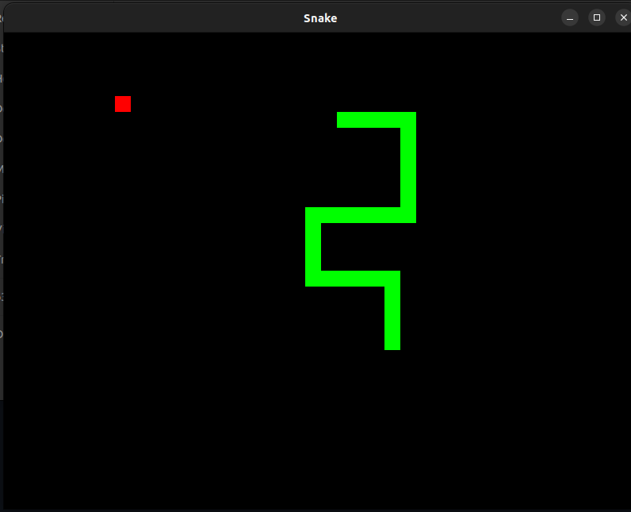

# 🐍 SFML SNAKE 🐍

Basic snake game based on SFML library. This app is intended to be used on linux, but if you provide dll files on Windows it will compile and work fine. 

Download files to location of your choice, then simply type "make" in your terminal. Subsequently launch executable by typing "/.a.out"

Make sure that you have SFML library installed, "sudo apt-get install libsfml-dev"

